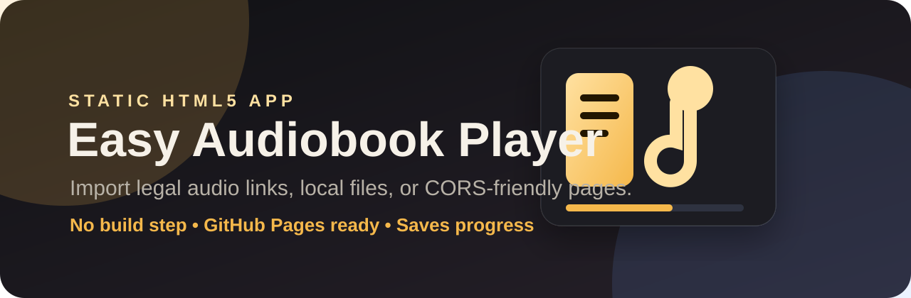

<p align="center">
  
</p>

# Easy Audiobook Player

A polished, static **HTML5 audiobook library/player** you can host on GitHub Pages, Netlify, your own server, or open directly in a browser.

It lets you add books from:

- Direct audio links such as `.mp3`, `.m4a`, `.ogg`, `.wav`, `.aac`, `.flac`, or `.opus`
- Copied HTML containing `<audio>`, `<source>`, or audio `href` links
- Page URLs that allow browser fetching with CORS
- Local audio files from your computer

> **Copyright note:** Use only audio you own, made yourself, is public domain, or that you have permission to host/play. The app does not bypass paywalls, logins, DRM, CORS, or website restrictions.

## Features

- Book library stored in `localStorage`
- Automatic audio link extraction from pasted text/HTML
- Optional page URL import when CORS allows it
- Drag-and-drop or file picker local audio import
- Chapter search/filter
- Previous/next chapter and auto-play next chapter
- Skip back/forward 15 seconds
- Saves listening position per chapter
- Playback speed selector
- Dark/light theme toggle
- Export, copy, import, and restore library JSON
- Works as a static site: no database, no build step

## Project structure

```text
easy-audiobook-player/
├── assets/
│   ├── banner.svg
│   └── icon.svg
├── src/
│   ├── app.js
│   └── styles.css
├── index.html
├── LICENSE
├── package.json
├── server.js
└── README.md
```

## Quick start

### Option 1: Open directly

Open `index.html` in your browser.

### Option 2: Run a local server

```bash
npm start
```

Then open the printed local URL.

### Option 3: Host on GitHub Pages

1. Create a new GitHub repository.
2. Upload all files in this folder.
3. In GitHub, go to **Settings → Pages**.
4. Choose **Deploy from a branch**.
5. Choose your `main` branch and `/root` folder.
6. Save.

## How to add a book

### Paste links or HTML

1. Open the app.
2. Go to **Add a book → Paste links/HTML**.
3. Enter a title and optional author.
4. Paste direct audio links or copied audio-player HTML.
5. Click **Find audio** to preview detected links.
6. Click **Add book**.

Example:

```text
https://example.com/my-audiobook/01.mp3
https://example.com/my-audiobook/02.mp3
https://example.com/my-audiobook/03.mp3
```

### Import from page URL

Paste a page URL and click **Import allowed audio links from page**.

This only works if the website allows browser CORS requests. If it fails, copy the page source or direct audio links and use the paste method instead.

### Add local files

Use **Local files** to choose or drag audio files from your computer. Local files work for immediate playback, but browser security means they may not keep working after reload.

## Library JSON format

```json
[
  {
    "title": "My Audiobook",
    "author": "Author Name",
    "source": "My website",
    "chapters": [
      { "title": "Chapter 1", "url": "https://example.com/audio/01.mp3" },
      { "title": "Chapter 2", "url": "https://example.com/audio/02.mp3" }
    ]
  }
]
```

## Custom domain: linacre.site

This project includes a `CNAME` file set to:

```text
linacre.site
```

For the domain to work with GitHub Pages, your DNS provider must point the apex/root domain to GitHub Pages. Add these `A` records if they are not already present:

```text
185.199.108.153
185.199.109.153
185.199.110.153
185.199.111.153
```

You can also add these `AAAA` records for IPv6:

```text
2606:50c0:8000::153
2606:50c0:8001::153
2606:50c0:8002::153
2606:50c0:8003::153
```

DNS changes can take a while to update. In GitHub, check **Settings → Pages** to confirm the custom domain and HTTPS status.

## Development

No dependencies are required.

```bash
npm start
npm test
```

`npm test` runs JavaScript syntax checks and verifies required project files.

## License

MIT. See [LICENSE](LICENSE).
